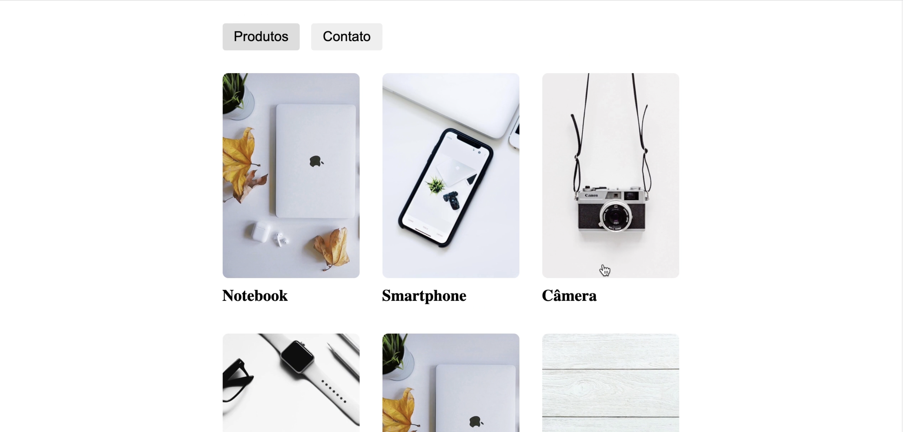
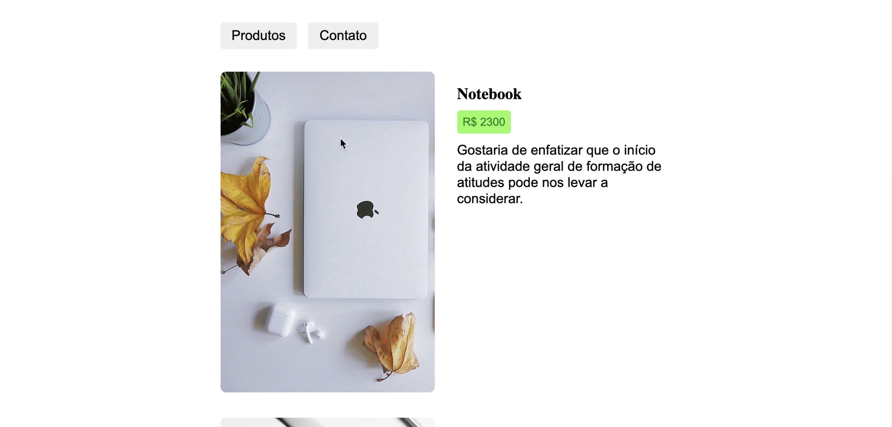
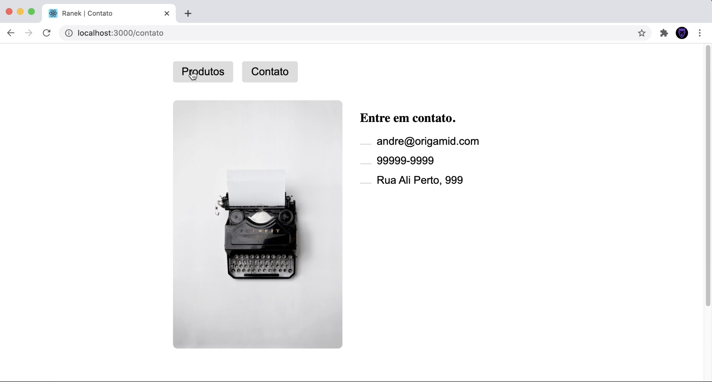

# Desafio Router 

// Utilize a API abaixo para puxar a lista de produto
// https://ranekapi.origamid.dev/json/api/produto
// Cada produto possui o id, o mesmo pode ser passado na api para retornar os dados desse produto específico
// https://ranekapi.origamid.dev/json/api/produto/notebook

* Devem ter animação de transição de página

## Tela inicial com listagem de produtos

## Tela detalhe produtos

## Tela contato

