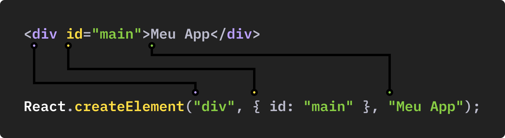

# React para Iniciantes

> React Básico, Vite, JSX, Eventos, Components, Propriedades

## React Element

Todo elemento React é criado com a função createElement.
O Babel é o responsável por transformar o elemento criado com JSX
(que se parece com HTML) em funções de React.

```javascript
function App() {
  return <div id="container">Meu App</div>;
}
// É transformado em:
function App() {
  return React.createElement("div", { id: "container" }, "Meu App");
}
```

Explicação:

> Babel: https://babeljs.io/repl

## Componentes

Permitem você dividir a sua interface em pequenos elementos.
São criados através de funções que retornam elementos React.

```javascript
// Function Component
const Button = () => {
  return <button>Comprar</button>;
};

// Quando a função retorna HTML é um componente funcional
// deve ser utilizado assim:
<Button />

const Button = () => {
  return "Comprar";
};

// Quando o retorno são valores primitivos ou objetos 
// deve ser utilizado como uma função normal
Button();
```

## Composição

O principal motivo de criarmos componentes é para podermos
compor a interface com diversos componentes que podem ser reutilizados.

```javascript
const Button = () => {
  return <button>Comprar</button>;
};

const MainNav = () => {
  return (
    <nav>
      <a href="#">Link 1</a>
      <Button />
    </nav>
  );
};

const App = () => {
  return (
    <div>
      <MainNav />
      <Button />
    </div>
  );
};
```

## Javascript {}

Utilizamos as `{}` para executar expressões de Javascript e mostrar
o resultado no DOM.

```javascript
const Produtos = () => {
  const produto1 = 'Camisa';
  const produto2 = 'Bermuda';

  return (
    <div>
      <button>
        Comprar {produto1} - R$ {Math.random()}
      </button>
      <button>
        Bermuda {produto2} - R$ {Math.random()}
      </button>
    </div>
  );
};

```

## Eventos

Podemos atribuir eventos diretamente aos elementos.

```javascript
const Produtos = () => {
  function handleClick(event) {
    console.log('Comprou: ' + event.target.innerText);
  }

  return (
    <div>
      <button onClick={handleClick}>Camisa</button>
      <button onClick={handleClick}>Bermuda</button>
    </div>
  );
};
```

## Hooks

Utilizamos o React pela facilidade de sincronização do estado.
Os Hooks são funções especiais de React, o useState possibilita a sincronização do estado.

```javascript
const Compras = () => {
  // useState é um Hook que define uma variável reativa
  const [count, setCount] = React.useState(0);

  return (
    <div>
      <button onClick={() => setCount(count + 1)}>Comprar: {count}</button>
      <p>Total: {count}</p>
      <p>Preço: R$ {count * 250}</p>
    </div>
  );
};
```
